# 📅 Self Attendance

  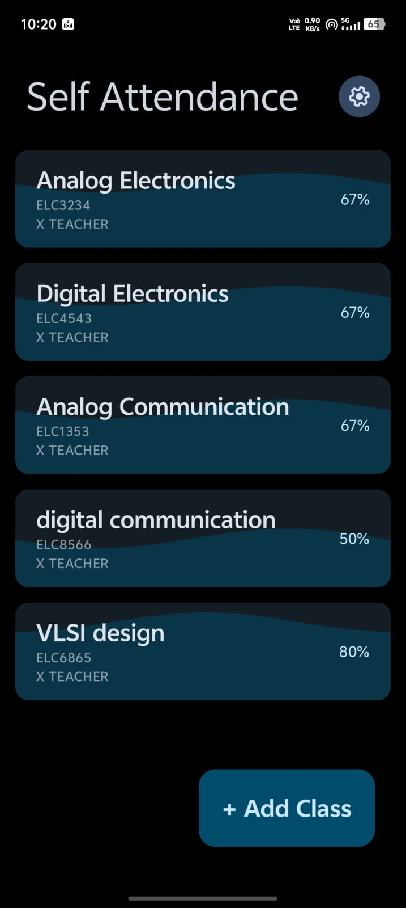
  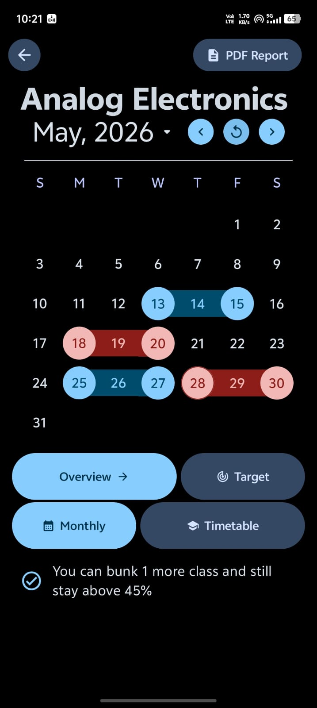
  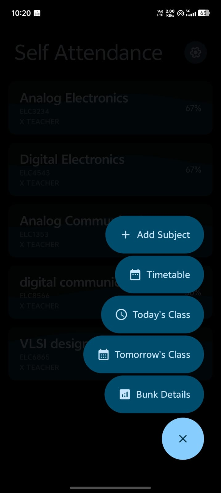

  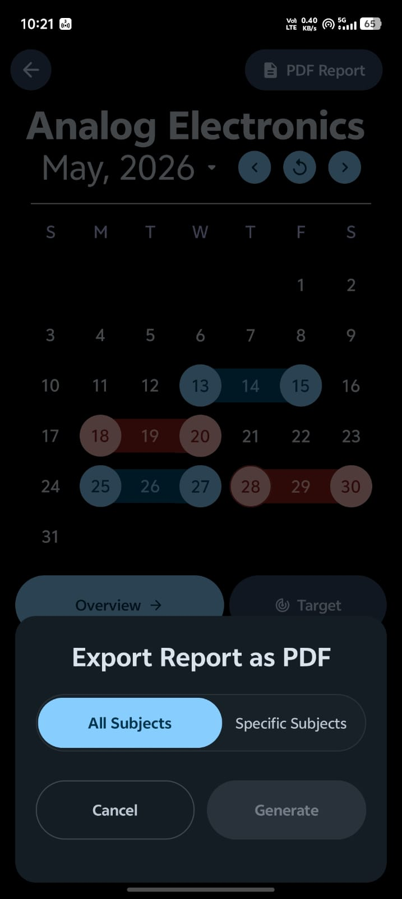
  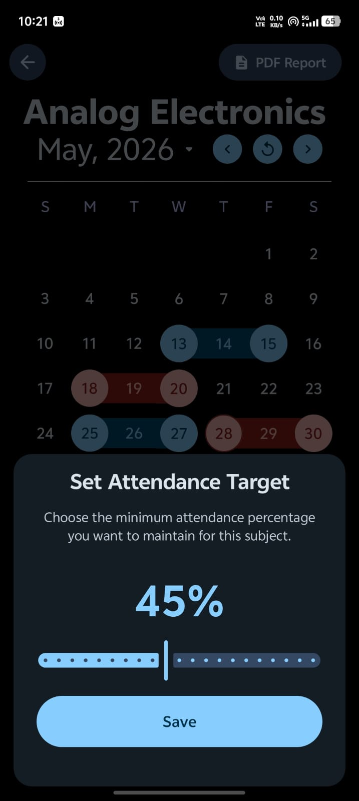
  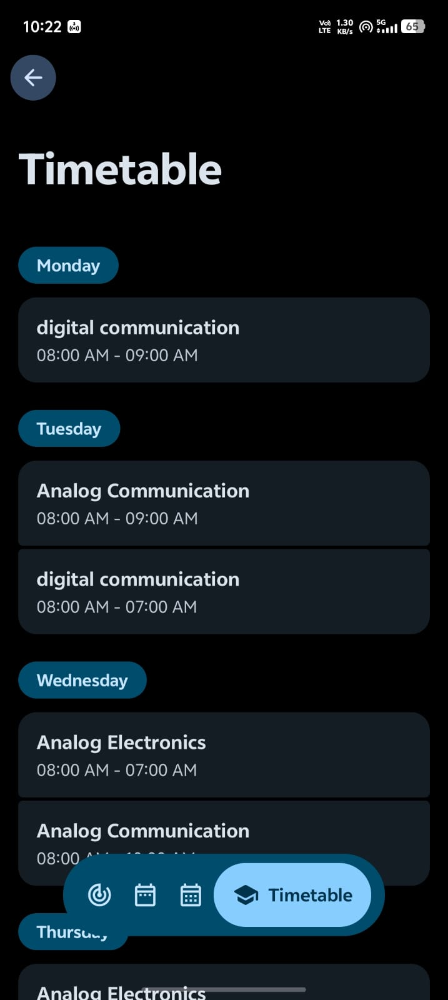

  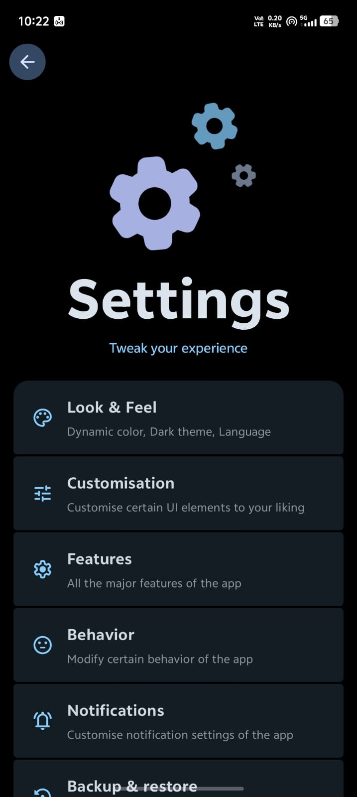
  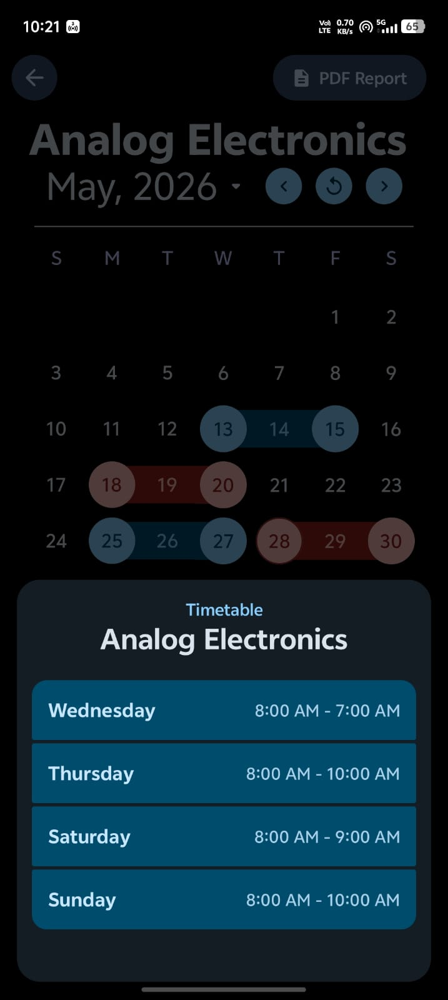
  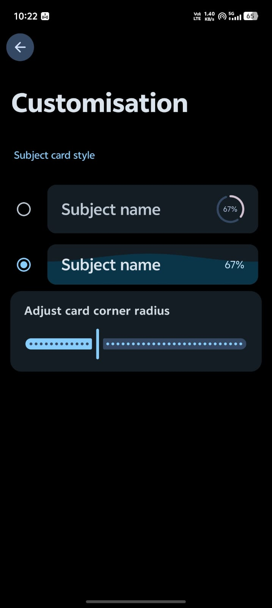

  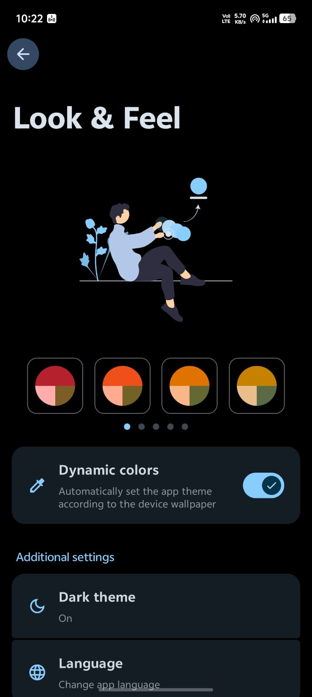
  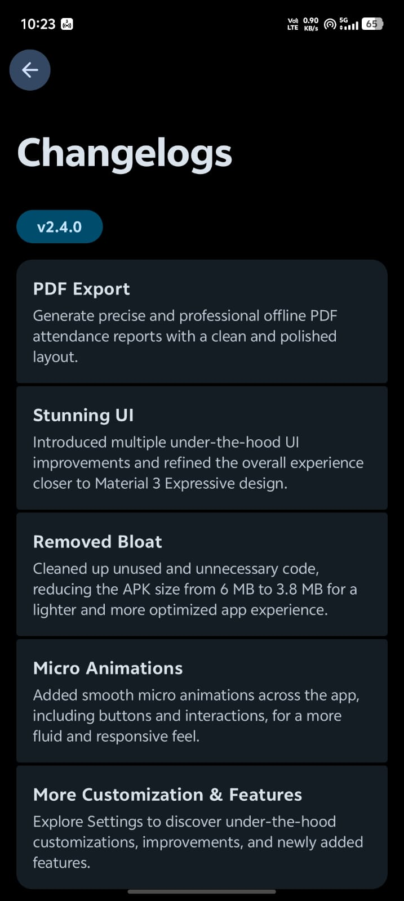
  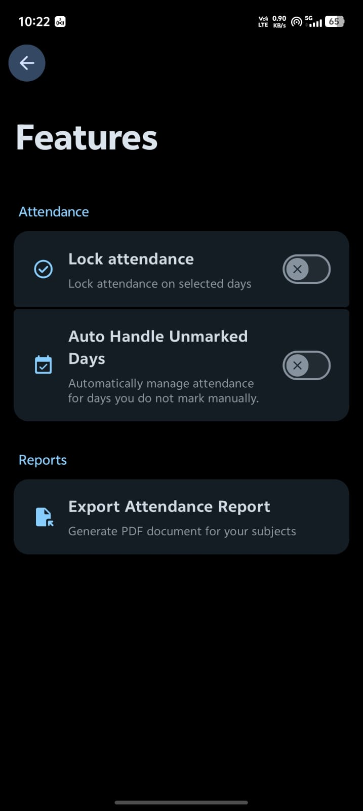

  
  
  
  

  

## Self Attendance

Self Attendance is a privacy-first attendance tracker built for students who want more than simple attendance counters. Instead of only displaying percentages, the app provides a calendar-first experience where every attendance record is tied to a specific date, making attendance management more visual, accurate, and intuitive.

### What's New in v2.4.0

#### PDF Export

Generate precise and professional offline PDF attendance reports with a clean, polished, and print-ready layout. Reports include detailed attendance statistics and subject-wise insights while remaining completely offline. The export system has been optimized to produce consistent and high-quality results every time.

#### Stunning UI

This update introduces numerous under-the-hood UI refinements throughout the application. Components, layouts, spacing, and interactions have been improved to create a cleaner and more modern experience inspired by Material 3 Expressive design principles. The result is a smoother and more polished interface across the entire app.

#### Removed Bloat

A major cleanup pass was performed across the codebase to remove unused code, redundant resources, and unnecessary assets. These optimizations reduced the application size from 6 MB to 3.8 MB while preserving all existing functionality. Users benefit from faster downloads, reduced storage consumption, and improved overall efficiency.

#### Micro Animations

Subtle micro animations have been added throughout the application to improve responsiveness and interaction feedback. Buttons, navigation elements, selectors, and other interactive components now feel smoother and more natural during everyday use. These improvements enhance the overall user experience without becoming distracting.

#### More Customization & Features

Several new customization options and quality-of-life improvements have been introduced across the app. Users can discover additional controls and personalization settings that provide greater flexibility over attendance management. These additions make the application more adaptable to different workflows and preferences.

### Why Choose Self Attendance?

- Calendar-based attendance tracking
- Smart bunk and attendance calculations
- AI-powered attendance insights
- Professional PDF report generation
- Attendance streak tracking
- Timetable management
- Attendance automation tools
- Backup and restore support
- Material 3 Expressive design
- Fully offline and privacy-first

### Key Features

#### Calendar-Based Attendance

Track attendance directly on a visual calendar where every attendance record is associated with a specific date. Easily identify attendance patterns, missed classes, and monthly trends at a glance.

#### Smart Attendance Insights

Receive intelligent attendance calculations that tell you exactly how many classes you can bunk or attend to reach your target attendance percentage. No manual calculations required.

#### Attendance Automation

Automatically handle unmarked attendance days using customizable behaviors. Choose whether unmarked classes should be marked as attended, absent, or ignored entirely.

#### Timetable Management

Create and manage a complete weekly timetable with support for daily schedules, upcoming classes, and quick attendance access.

#### Intelligent Notifications

Receive precise class reminders powered by AlarmManager and quickly mark attendance directly from notifications without opening the app.

#### Professional PDF Reports

Generate detailed offline PDF attendance reports with subject-wise statistics, attendance percentages, and a clean professional layout.

#### Backup & Restore

Securely export and restore your attendance data and settings locally, making migration between devices simple and reliable.

#### Material 3 Expressive UI

Enjoy a modern Android experience built with Jetpack Compose and Material 3 Expressive design principles, featuring smooth interactions and polished animations.
